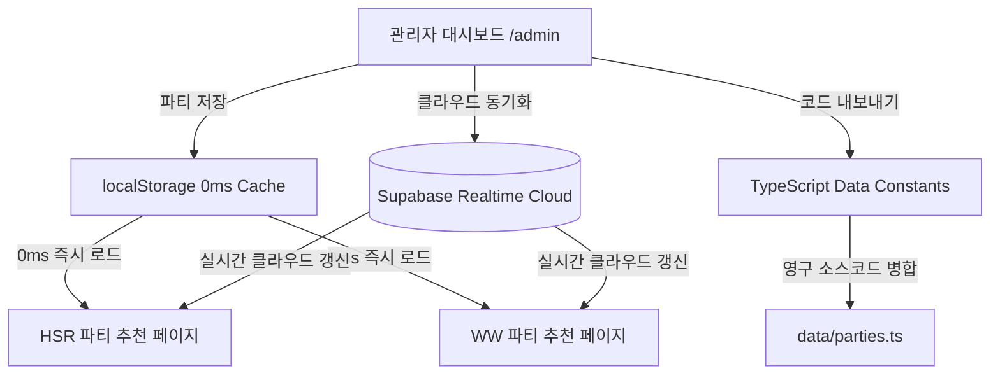

# 🎮 관리자 파티 추천 빌더 & 돌파 시스템 가이드 (Party Builder Guide)

> **문서 용도**: 관리자 대시보드(`/admin`)의 [파티 추천 관리] 모듈 사용법과 데이터 동기화 파이프라인(Supabase, localStorage, TypeScript Code Exporter)을 상세히 설명하는 개발 및 운영 가이드입니다.

---

## 1. 🌟 핵심 기능 개요

1. **멀티 게임 규격 자동 동기화**:
   * **붕괴: 스타레일 (HSR)**: 4인 고정 슬롯 + 카테고리(환락, 추가 공격, 격파 등).
   * **명조: 워더링 웨이브 (WW)**: 3인 고정 슬롯 + 전투 역할.
   * **Neverness to Everness (이환 - NTE)**: 4인 고정 슬롯 + 속성 시너지.

2. **슬롯 우선 배치 ➡️ 배치 전용 메인 딜러 토글**:
   * **1단계**: 파티 슬롯 멤버(Slot 1~4)를 클릭하여 캐릭터를 먼저 배치합니다.
   * **2단계**: **1단계에서 배치된 캐릭터들만** 일러스트와 역할이 담긴 토글 카드로 노출되어, 원클릭으로 메인 딜러를 황금 하이라이트(`✓`) 지정할 수 있습니다.
   * **3단계**: 파티 설명 및 태그 입력 후 저장합니다.

3. **돌파(Breakthrough) 추천 시스템**:
   * 본체 슬롯 캐릭터 및 대체 캐릭터별로 권장 성혼/돌파 수치를 개별 지정할 수 있습니다:
     * `명함 (E0 / S0)`
     * `1돌+ 권장`
     * `2돌+ 권장`
     * `2돌 필수`
     * `4돌+`
     * `6돌 (풀돌)`
   * 지정된 돌파 수치는 아바타와 툴팁에 세련된 황금빛 뱃지(`2돌+`)로 자동 렌더링됩니다.

4. **특수 문자 및 타이핑 단축 도구**:
   * `[ • ]` (불릿), `[ · ]` (가운뎃점) 원클릭 삽입 버튼.
   * 슬롯에 배치된 캐릭터명을 한 번에 파티명에 추가하는 `[+ 천야•블레이드]` 이름 삽입 칩.
   * `[✨ 파티명 자동완성]` 원클릭 버튼.

5. **고정 높이 검색 모달 UX**:
   * 캐릭터 선택 팝업 창이 `h-[650px]`로 완전 고정되어, 검색어를 입력하거나 지워도 창 높이가 출렁이지 않고 부드럽게 스크롤됩니다.

---

## 2. ☁️ 3단계 데이터 동기화 파이프라인



### 1단계: 브라우저 로컬 저장 (`localStorage`)
* 관리자가 파티를 작성하고 [파티 저장 완료]를 누르면 `parties_HSR`, `parties_WW`, `parties_NTE` 키로 브라우저에 즉시 저장됩니다.
* 일반 추천 페이지(`/gallery/hsr/parties`)에 접속하면 `0ms` 지연 없이 로컬 스토리지 데이터가 최우선 로드됩니다.

### 2단계: Supabase 클라우드 실시간 동기화
* 상단의 **`[클라우드 동기화]`** 버튼을 누르면 Supabase의 `party_recommendations` 테이블에 저장되어, 사이트 재빌드 없이도 모든 일반 유저에게 실시간 반영됩니다.
* **Supabase 테이블 스키마**:
```sql
CREATE TABLE IF NOT EXISTS party_recommendations (
    id UUID PRIMARY KEY DEFAULT gen_random_uuid(),
    game_id TEXT NOT NULL,
    party_id TEXT NOT NULL,
    name TEXT NOT NULL,
    description TEXT,
    category TEXT,
    element_synergy TEXT,
    main_dps TEXT,
    tags JSONB DEFAULT '[]'::jsonb,
    pros JSONB DEFAULT '[]'::jsonb,
    cons JSONB DEFAULT '[]'::jsonb,
    members JSONB DEFAULT '[]'::jsonb,
    display_order INT DEFAULT 0,
    updated_at TIMESTAMP WITH TIME ZONE DEFAULT NOW()
);
```

### 3단계: TypeScript 코드 내보내기 (`[코드 내보내기]`)
* 우측 상단의 **`[코드 내보내기]`** 버튼을 누르면 전체 파티 데이터가 `export const HSR_PARTIES = [...]` 형식으로 클립보드에 복사됩니다.
* 소스코드의 `parties.ts`에 붙여넣어 영구 기본 내장 데이터로 병합할 수 있습니다.
